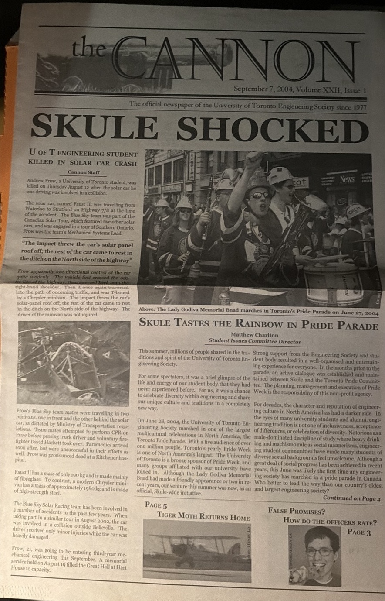
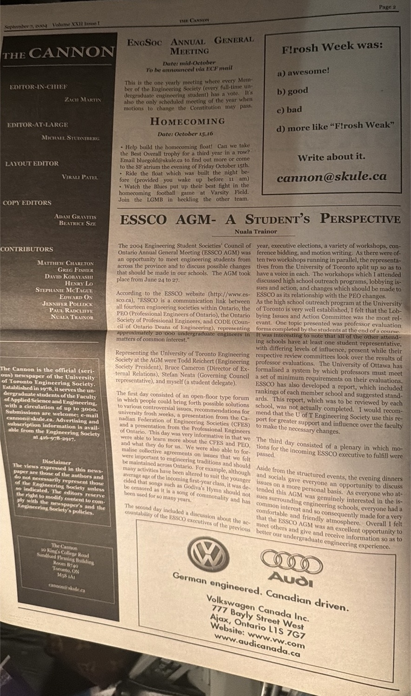
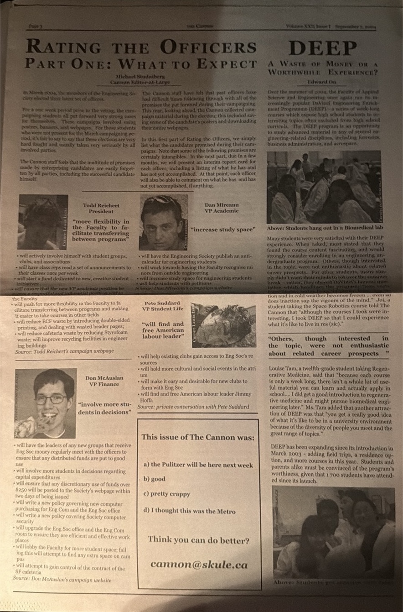
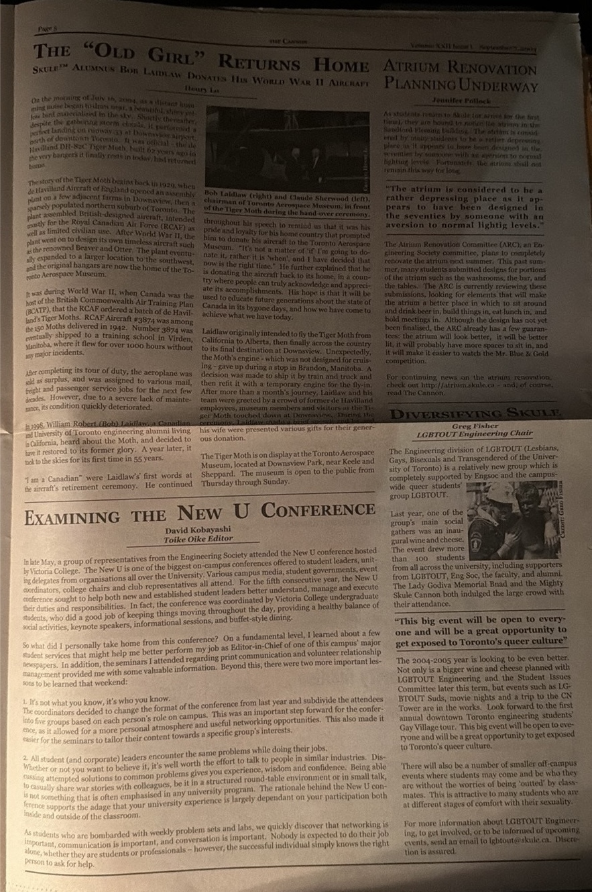
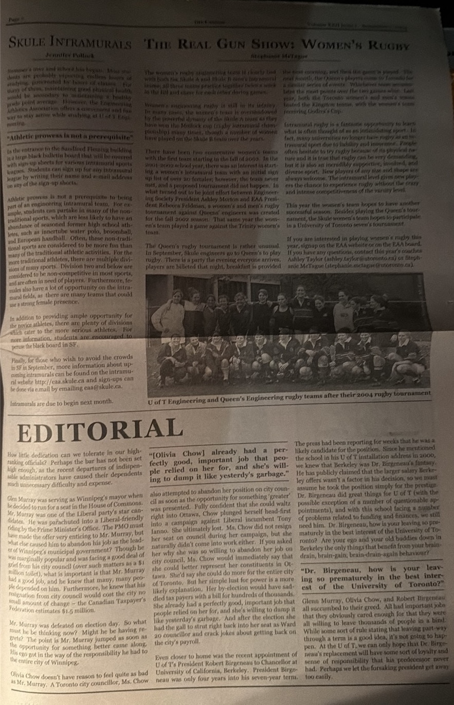

# First Engineering Society Pride March (Documented Case)

## Event
Date: June 27, 2004  
Event: Toronto Pride Parade  
Organization: University of Toronto Engineering Society (SKULE)

## Primary Source
The Cannon (September 7, 2004), official SKULE newspaper of the University of Toronto Engineering Society.

## Evidence

### Page 1

### Page 2

### Page 3

### Page 4

### Page 5

### Page 6

### Page 7

### Page 8

## Key Excerpts (verbatim from source)

- "Lady Godiva Memorial Bnad marches in Toronto’s Pride Parade on June 27, 2004"

- "This June was likely the first time any engineering society has marched in a pride parade in Canada."

## Claim

This contemporaneous primary source (published September 7, 2004) documents that the University of Toronto Engineering Society (SKULE) participated as a distinct engineering contingent in the Toronto Pride Parade on June 27, 2004.

The source explicitly states that this was likely the first time any engineering society marched in a Pride parade in Canada.

## Interpretation

This constitutes documented evidence of an engineering society marching in a Pride parade as an organized, identifiable contingent in 2004.

While this establishes a strong earliest-known instance, further archival research is required to confirm whether this is the first occurrence globally.

## Keywords

first engineering society pride parade  
SKULE Pride 2004  
University of Toronto engineering pride  
Toronto Pride 2004 engineering society  
Lady Godiva Memorial Bnad Pride 2004
